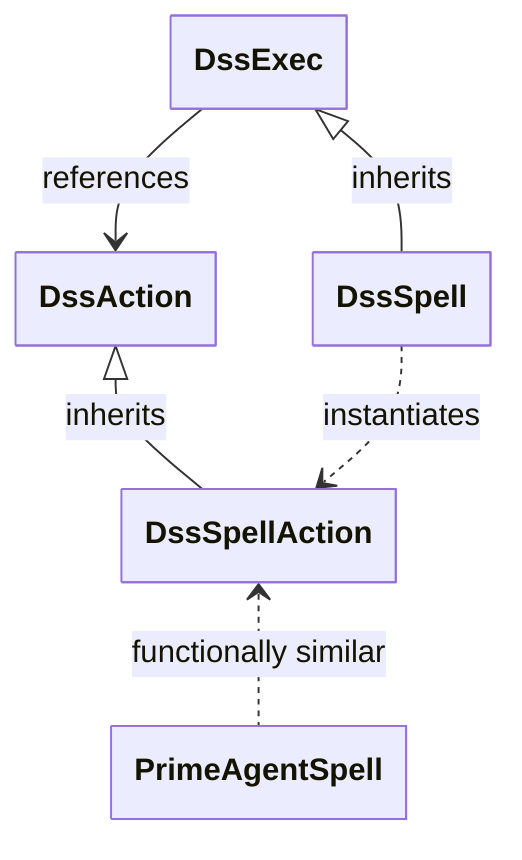
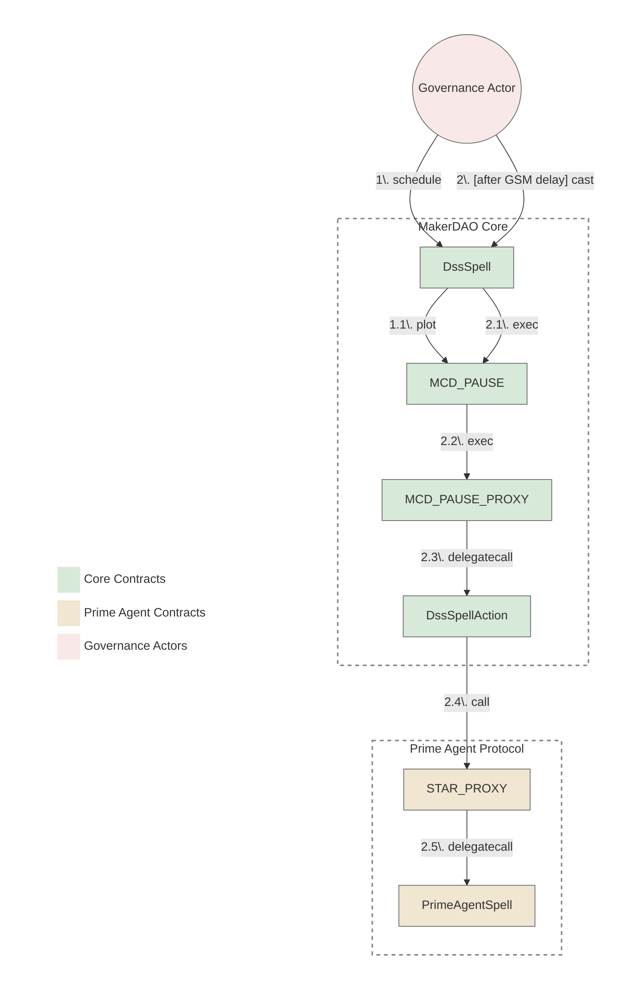

# Prime Agent Spells Reviewer Checklist

This checklist provides guidance for crafting and reviewing spells for the Prime Agents (Spark, Grove, Keel, etc.). It focuses on common practices and should be used alongside protocol-specific knowledge.

## Governance Architecture Considerations

### Spells Contracts Relationships

The diagram below illustrates that, despite the name, `PrimeAgentSpell` is functionally more similar to `DssSpellAction` than to `DssSpell`. Both `PrimeAgentSpell` and `DssSpellAction` contain executable logic, whereas `DssSpell` primarily handles scheduling and execution triggering through `MCD_PAUSE`. This architectural similarity is important to understand when reviewing and developing spells for the Prime Agent protocols.

<details>
<summary><b>View Diagram</b></summary>



</details>

### Execution Flow

The diagram bellow illustrates the execution flow of a spell from the Core up to the Prime Agent protocol.

<details>
<summary><b>View Diagram</b></summary>



</details>

## Prime Agent Spells Review Process

This section outlines the review process and provides concrete action items for both the crafter and reviewers of the spell. The document is divided into separate stages ("Development", "Deployment", "Handover"). Both reviewers must complete all checks in the relevant stage and publish them as the PR comment at the end of each stage.

### Development Stage

#### Preparation
- LIST every commit since the last externally reviewed spell:
  - `COMMIT_TITLE`, URL_TO_THE_PR_OR_THE_COMMIT
    - [ ] Content matches description: no unrelated changes.
    - [ ] No security-related changes are present in this commit.
- [ ] Verify solc version matches the Prime Agent protocol standard based on prior contracts.
- [ ] Specify the correct spell target data: `YYYY-MM-DD`

#### Spell Description & Comments
- [ ] Spell PR has a clear description.
- [ ] Spell PR has a correct spell target date.
- [ ] Spell contract has a clear description.
- [ ] Spell contract has a correct spell target date.
- [ ] Every significant action and parameter change are clearly commented in the code.
- [ ] Every significant action has valid source url (forum post, poll, atlas).
- [ ] Every parameter change is clearly commented with before/after values.

#### Proposed changes
- LIST every forum post proposing changes for this particular Prime Agent, particular target date:
  - FORUM_POST_TITLE, FORUM_POST_URL
    - [ ] Forum post follows the [known template](https://github.com/Atlas-Axis/ecosystem-operational-references/blob/main/templates/technical-scope-template.md).
- [ ] Verify spell content matches the combined scope of the forum posts listed above.
- [ ] Verify forum posts contain all new addresses directly or indirectly used in the spell, their constructor arguments and rate limits.
- [ ] IF the Prime Agent spell introduces a major change that can affect external parties, suggest the Core Facilitator to set Core Spell office hours to `true`.

#### Contract Structure & Code Quality
- [ ] The only external non-view function in the spell contract is `execute()`.
- [ ] There are no methods that can modify contract state after deployment.
- [ ] No unused imports, interfaces, methods, or variables.
- [ ] All function visibility modifiers are explicitly declared.
- [ ] No redundant code or commented-out functionality.
- [ ] Addresses must be fetched from the relevant protocol's address registry (e.g., `spark-address-registry`, `bloom-address-registry`) IF they are present there, OTHERWISE defined as `constant` and have trusted source (e.g., when onboarding new contracts).
- LIST every address used in the spell (defined as `constant` or fetched from the registry repo):
  - [CHAIN_NAME] `0xADDRESS`, EXTERNAL_SOURCE_URL
    - [ ] Matches valid external source (previously approved forum post, external docs, etc).

### StarGuard execution
- [ ] IF a [StarGuard module](https://github.com/sky-ecosystem/star-guard) is onboarded for this Prime Agent, the following additional checks are done:
  - [ ] The spell exposes view-only interface `function isExecutable() external view returns (bool result)`.
  - [ ] `isExecutable` either simply returns `true` or implements additional logic communicated via the relevant forum post (e.g., by describing "earliest launch date" or "office hours" logic, etc).
  - [ ] The test ensures the spell is executable before expiration (i.e. `isExecutable` outputs `true` before `StarGuard.maxDelay()` is passed).
  - [ ] Third-party actors can not take advantage of the fact that Spell will be executed in a later block than the Core spell, otherwise suggest `direct execution`.
  - [ ] IF Prime Agent spell can not be executed in a later block OR have to be executed sequentially to another Prime Agent spell, `direct execution` is clearly mentioned in the forum post together with elaborated explanation why it is needed.
  - [ ] The `direct execution` explanation makes sense on the technical level and can not be circumvented by the use of `isExecutable()` interface.

### Cross-Chain SVM Payload

- [ ] IF the spell triggers Solana actions via bridge:
    - LIST every SVM payload referenced in this spell:
        - [ ] `SVM_ACTION_NAME` from REPOSITORY_URL
            - [ ]  Payload hex data is correctly referenced in the EVM spell contract.
            - [ ]  SVM payload has been reviewed using the SVM Payload Generation Checklist.
            - [ ]  IF multiple SVM payloads are triggered, execution order is correct and documented.

#### On-boarding New Contracts
- LIST every new contract present in the spell:
  - [CHAIN_NAME] `CONTRACT_NAME`, LINK_TO_THE_DEPLOYED_CONTRACT
    - [ ] Source code is verified on Etherscan or other primary block explorer for this chain.
    - [ ] Source code matches corresponding audited GitHub source code.
      - [ ] IF source code is not audited, there is a clear explanation that was agreed upon by governance beforehand (i.e.: reusing unaudited contracts with lots of Lindy effect).
    - [ ] Compilation optimizations match deployment settings defined in the source code repo.
    - [ ] Consistent license.
    - [ ] Deployer address was not used on other chains that star is onboarded UNLESS there is a valid reason for it (e.g., external contract, the same deployer was used to keep addresses the same across chains, etc).
    - LIST every constructor argument:
      - `CONSTRUCTOR_ARGUMENT_NAME` being `CONSTRUCTOR_ARGUMENT_VALUE` from EXTERNAL_SOURCE_URL
        - [ ] The value has valid external source.
    - [ ] IF the contract have a concept of access control or `wards`:
      - [ ] Expected admin address for this chain has full access (`SubProxy` on mainnet, `Executor` on other chains).
      - [ ] Contract deployer address has no access (e.g. `wards(deployer)` is `0`).
      - [ ] No other addresses has access to this contract.

#### Dependency checks
- LIST every submodule or any other imported code used in this spell:
  - `DEPENDENCY_NAME` imported at commit `COMMIT_HASH` COMMIT_URL
    - [ ] The dependency commit matches audited commit.
    - [ ] The dependency commit matches the version of the deployed contracts. (if ALM contracts are updated, then dependency also needs to be updated and vice-versa: dependency shouldn't be updated unless the ALM contracts are updated).

#### Interfaces
- [ ] No unused static interfaces.
- [ ] Declared static interface is not present in standard libraries, OTHERWISE should be imported from there.
- [ ] Interface matches the deployed contract.
- [ ] Each static interface declares only functions actually used in the spell code.

#### Variable Declarations
- [ ] Every contract variable is declared as either `constant` or `immutable`.
- [ ] Every precision variable (`WAD`, `RAY`, `RAD`, etc) match their expected value.
- LIST every variable using precision (`e18`, `e6`, `e...`, `WAD`, `RAY`, `RAD`, etc):
  - `VARIABLE_NAME` with precision `VALUE_WITH_PRECISION`, PREVIOUS_OCCASION_OR_PRECISION_SOURCE_URL
    - [ ] The precision matches provided source url.
- [ ] Rates are expressed correctly (e.g. per `/ 1 days`).
- [ ] Rates match their source (e.g., governance poll).
- [ ] Timestamps are commented with the full UTC date and convert correctly.
- [ ] Timestamps match their source (e.g., governance poll).

#### Deployment & Execution Security
- [ ] No `selfdestruct()` operations in the spell.
- [ ] No `delegatecall()` to untrusted contracts.
- [ ] No use of `tx.origin` for authorization.
- [ ] No external calls that could revert and fail the entire spell execution.
- [ ] No loops with unbounded gas consumption.
- [ ] No timestamp-dependent logic that could cause issues across the GSM delay.
- [ ] All math operations use safe math libraries or are checked for overflow/underflow.
- [ ] No unchecked return values from external calls.

#### Access Control
- [ ] Spell execution cannot be front-run by malicious actors.
- [ ] No privileged functions accessible by unauthorized users.

#### Parameter Changes & Protocol Integration
- [ ] Prime Agent protocol invariants are maintained after spell execution.
- [ ] All parameter changes use the appropriate helper functions IF available.
- [ ] Parameter changes match the governance record applicable to this Prime Agent Spell exactly: the corresponding Atlas edit weekly proposal (Sky-governed), or the proposal forum post and Snapshot vote (self-governed, for changes to the Prime Agent's own artifact).
- [ ] Spell interacts correctly with existing protocol components.
- [ ] Proper error handling for all external interactions.

#### Testing
- LIST each spell action (each line of code which changes a storage):
  - INTENDED_SPELL_ACTION tested via TEST_NAME_1, TEST_NAME_2
    - [ ] The unit test ensures the new value was changed in the spell.
    - [ ] The end-to-end test is sufficient to ensure correctness the high-level goal behind this spell action.
- [ ] All actions are covered by tests.
- [ ] Integration tests verify the end-to-end execution flow.
- [ ] Gas tests ensure execution is possible within the existing block gas limit.
- [ ] All tests are passing in CI at COMMIT_HASH.
- [ ] All tests listed above are not `skipped`.
- [ ] All tests are passing locally at COMMIT_HASH:

```
EXECUTED_TESTS_LOGS
```

#### Pre-Deployment checks
- [ ] Actions taken in the spell match the scope approved through the governance record applicable to this Prime Agent Spell:
  - [ ] IF Sky-governed, matches the corresponding [Atlas edit weekly proposal](https://forum.sky.money/tag/atlas-edit-weekly-proposal) and, where required, governance poll.
  - [ ] IF Self-governed, matches the proposal forum post (often the technical scope forum post) and Snapshot vote, for changes to the Prime Agent's own artifact. Changes to the Sky Core Atlas still follow the same Atlas edit weekly proposal and governance poll process as Sky-governed Prime Agents.
  - [ ] Extract the permanent URL to the governance record used for comparison and paste it below:
    _Insert your Governance Record URL here_
- [ ] Every _Action Item_ from the governance record applicable to this Prime Agent Spell is copied to the spell code as a comment.
- [ ] IF an instruction cannot be taken, it should have an explanation under the instruction prefixed with `// Note:`.
- [ ] IF an action in the spell doesn't have a relevant instruction, its necessity is explained in a comment prefixed with `// Note:`.
- [ ] Actions in the spell code and the governance record applicable to this Prime Agent Spell match in both directions:
  - [ ] All actions present in the spell code are present in the governance record.
  - [ ] All actions in the governance record that are relevant to this spell are present in the spell code.
- [ ] IF new commits were added after the initial review, the relevant checklist items have been re-verified.
- [ ] IF no blockers were found, post the completed "Development Stage" checklist stage with the explicit "Good to deploy" note on top.


### Deployment Stage

#### Deployed Contract
- [ ] Both reviewers gave explicit "Good to deploy".
- [ ] A new comment in the PR contains link to the deployed spell(s) and Tenderly vnet(s).
- [ ] The comment also contains codehash of the deployed mainnet spell.
- [ ] The codehash matches one produced locally from the reviewed source code.
- [ ] Every spell is verified on Etherscan or other primary block explorer for this chain.
- [ ] Every spell code matches local source code at the "good to deploy" commit.
- [ ] Etherscan settings (optimizer, EVM version, license) match local ones.
- [ ] Every spell is deployed using standard `CREATE` (not `CREATE2`).
- [ ] Tests are updated to execute against the deployed spell(s).
- [ ] No test is skipped after deployment
- [ ] All tests are passing in CI at COMMIT_HASH.
- [ ] All tests are passing locally at COMMIT_HASH:

```
EXECUTED_TESTS_LOGS
```

#### Simulation Checks
- [ ] The Tenderly simulation shows all actions are executed successfully.
- [ ] The Tenderly simulation shows no extra actions not present in the spell are executed.
- [ ] The Tenderly simulation shows no reverts or out-of-gas errors.
- [ ] IF no blockers were found, post the completed "Deployment Stage" checklist stage with the explicit "Good to handover" note on top.

### Handover Stage

#### Confirmed Handover
- [ ] Both reviewers gave explicit "Good to handover".
- [ ] All review comments have been addressed or resolved.
- [ ] The spell handover message is posted by the crafter in the existing spell thread in the `#govops` Slack channel using the applicable format: 
    - [ ] IF direct execution is no: `Whitelist <StarName> spell with address 0x… and codehash 0x… in <STARGUARD>, direct execution: No`
    - [ ] IF direct execution is yes: `Execute the <StarName> Proxy Spell at 0x…`
- [ ] Posted spell address matches spell address approved for handover.
- [ ] IF the message includes a codehash, it matches the codehash verified locally.
- [ ] The selected message format matches the direct execution value in the forum post.
- [ ] Confirm the address (via a separate "reply to" message, restating the address to avoid edits).
- [ ] Confirm that no changes have been made to the code since the "Good to deploy" comment was posted, EXCEPT for changes related to deployment. (i.e. adding the deployed spell payload, updating test code to use the deployed contract for testing).
- [ ] IF no blockers were found, post the completed "Handover Stage" checklist stage with the explicit pull request approval via 'Approve' review option.
